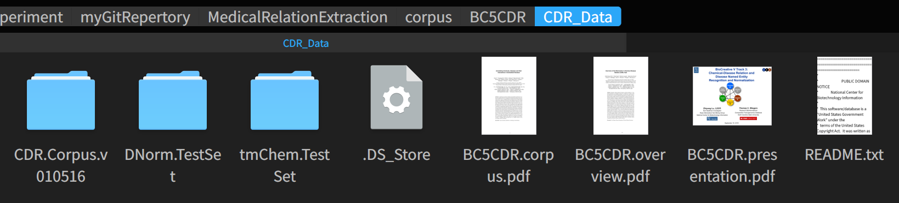
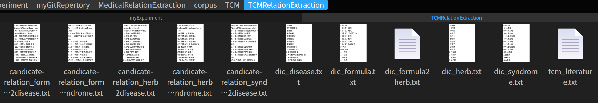
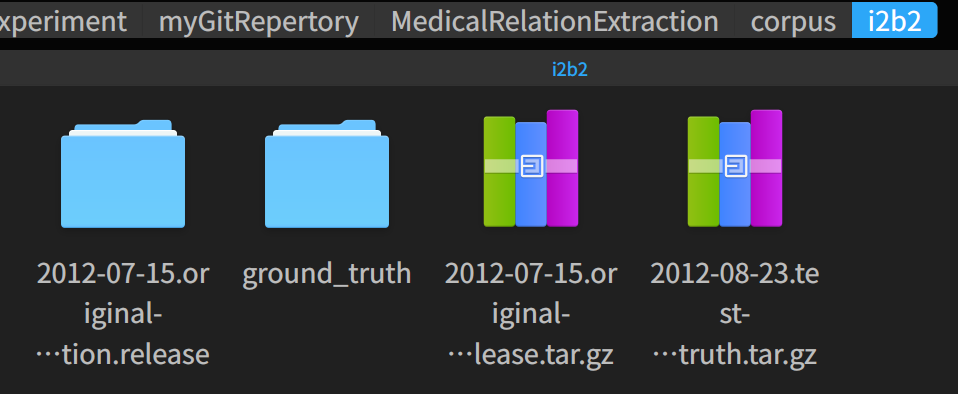

This is an implementation of BERT-CNN model used in our paper "A General Approach for Improving Deep Learning-based Medical Relation Extraction using a Pre-trained Model and Fine-tuning"

The depository support training and testing BERT-CNN model on three medical relation extraction corpora: BioCreative V CDR task corpus (in short, BC5CDR corpus), traditional Chinese medicine (TCM) literature corpus (in short, TCM corpus), and the 2012 informatics for integrating biology and the bedside (i2b2) project temporal relations challenge corpus (in short, i2b2 temporal corpus). These scripts are based on [google-research/bert](https://github.com/google-research/bert) and [cjymz886/text_bert_cnn](https://github.com/cjymz886/text_bert_cnn). Thanks!

# Requirement
- python 3
- tensorflow 1.9.0+
- bert
- numpy
- sklearn
- pandas
- jieba

# Datasets
- BioCreative V chemical-disease relation (CDR) corpus (in short, BC5CDR corpus) (13, 14, 16, 34): It consists of 1,500 PubMed articles with 4,409 annotated chemicals, 5,818 diseases, and 3,116 chemical-disease interactions. The relation task data is publicly available through BioCreative V at https://biocreative.bioinformatics.udel.edu/resources/corpora/biocreative-v-cdr-corpus/.

- Traditional Chinese medicine (TCM) literature corpus (in short, TCM corpus) (32): The abstracts of all 106,150 papers published in the 114 most popular Chinese TCM journals between 2011 to 2016 are collected. 3024 herbs, 4957 formulae, 1126 syndromes, and 1650 diseases are found. 5 types of relations are annotated. The entire dataset is available online at http://arnetminer.org/TCMRelExtr.

- The 2012 informatics for integrating biology and the bedside (i2b2) project temporal relations challenge corpus (in short, i2b2 temporal corpus) (29, 30): It contains 310 de-identified discharge summaries of more than 178,000 tokens, with annotations of clinically significant events, temporal expressions and temporal relations in clinical narratives. On average, each discharge summary in the corpus contains 86.6 events, 12.4 temporal expressions, and 176 raw temporal relations. In this corpus, 8 kinds of temporal relations between events and temporal expressions are defined: BEFORE, AFTER, SIMULTANEOUS, OVERLAP, BEGUN_BY, ENDED_BY, DURING, BEFORE_OVERLAP. The entire annotations are available at http://i2b2.org/NLP/DataSets.

# Usage
## 1) Download the data above. 

For BC5CDR corpus, unzip CDR_Data.zip in ./corpus/BC5CDR. The files in this folder are like this:

For TCM corpus, unzip TCMRelationExtraction.zip in ./corpus/TCM. The files in this folder are like this:

For i2b2 temporal corpus, unzip 2012-07-15.original-annotation.release.tar.gz and 2012-08-23.test-data.groundtruth.tar.gz in ./corpus/i2b2. 
    
The files in this folder are like this:

## 2) Download pre-trained BERT model.

Download uncased_L-12_H-768_A-12 and chinese_L-12_H-768_A-12 BERT models from https://github.com/google-research/bert. 
    
Unzip uncased_L-12_H-768_A-12.zip and chinese_L-12_H-768_A-12.zip in folder ./pretrained_bert_model.

## 3) Run  

    For BC5CDR corpus, run 
        python data_process_BC5CDR.py
        python run_BC5CDR.py train
        python run_BC5CDR.py test

    For TCM corpus,
        python data_process_TCM.py
        python run_TCM.py train
        python run_TCM.py test

    For i2b2 temporal corpus, 
        python data_process_i2b2.py
        python run_i2b2.py train
        python run_i2b2.py test

    The best model will save in folder ./result/checkpoints/. 
